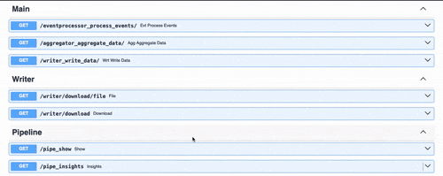
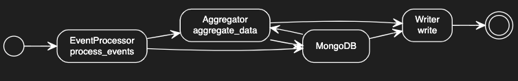
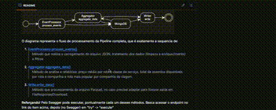
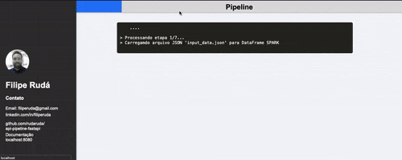
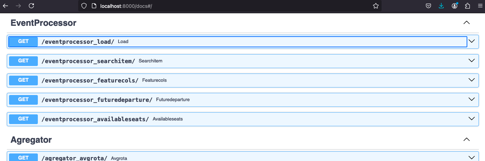

# fastapi-pyspark-mongodb-pipeline 

Projeto experimental de **Pipeline de dados** com **FASTAPI + PYSPARK + MONGODB**.
Básicamente a ideia é manipular os dados com PYSPARK armazenada snap_shot do DataFrames no MONGODB a cada transformação. 
E no final apresentar a evolução do pipeline de forma visualmente (isso mesmo em HTML como se fosse um front).

## Como utilizar
* Necessário ter Docker e Docker-compose (ou Podman + Podman Compose) instalado
* Utilizar o comando `docker-compose up` ou `podman-compose up` no diretório do repositório
* Aplicação roda em [http://0.0.0.0:8000/](http://0.0.0.0:8000/) ou [http://localhost:8000/](http://localhost:8000/) por padrão
* Verificar a [documentação](http://localhost:8000/docs): ([http://localhost:8000/docs](http://localhost:8000/docs));
* Caso queira rodar fora do Container, instalar as biblitecas `requirements.txt` e execute os arquivos em python.

### Pré-requisitos:

- DOCKER / PODMAN 
- JAVA 11

#### Instalandol as dependencies

Depende do sistema operacional, acesse o site dos desenvolvedores para mais informação:
 - [Docker/get-start](https://docs.docker.com/get-started/get-docker/)
 - [Podman/installation](https://podman.io/docs/installation)
 - [Java](!https://www.java.com/download/ie_manual.jsp)

### Executando localmente
- Clone o projeto:
```
git clone https://github.com/rudaruda/fastapi-pyspark-mongodb-pipeline.git
```
Estando no diretório do projeto, execute o conteiner com DOCKER:
```
docker-compose up
```
...ou com PODMAN *(recomendo)*:
```
podman-compose run up
```

### Testes


Todos os testes podem ser executados diretamente pelo Swagger:
- [localhost:8000/docs/Testes/test_all](http://localhost:8000/docs#/Testes/mongodb_test_all_get)
    > Reforço que temos no Swagger a documentação mais detalhada de cada serviço/funcionalidade.
- Ou executando o metodo `Test.execute()` em `/app/tests/test.py`

# Arquitetura da solução


**Dockerfile** com imagem *python:3.12-slim* que sustenta nossa aplicação em **Python** com **FastAPI**. Por sua vez esta se conectando com **PySpark** e realiza a manipulação de dados. A cada alteração do DataFrame é persisitindo um snap-shop dos dados no **MongoDB**. 
O MongoExpress esta aqui somente como utilitario, para visualizar os dados persistidos no MongoDB. 

##### O que é FastAPI
 [FastAPI](https://fastapi.tiangolo.com/) é um framework web Python, rápido e moderno, para criar APIs com suporte a validações automáticas e documentação integrada.

##### O que é PySpark
 [PySpark](https://spark.apache.org/docs/latest/api/python/index.html) é a API do Apache Spark para Python, usada para processamento distribuído de grandes volumes de dados.

##### O que é MongoDB
 [MongoDB](https://www.mongodb.com/pt-br/docs/manual/administration/install-community/) é um banco de dados NoSQL orientado a documentos, que armazena dados em formato JSON-like (BSON), permitindo flexibilidade e escalabilidade para aplicações modernas. Vamos além de "na minha máquina funciona" :blush:

##### O que é Docker
 [Docker](https://www.docker.com/get-started/) é uma plataforma para criar, distribuir e executar aplicativos em contêineres isolados.

##### O que é Podman
 [Podman](https://podman.io/get-started) tem o mesmo objetivo do Docker, incluive possui alta compatibilidade (mesmos comandos) que o Docker, porém consume menos recursos de máquina no desenvolvimento local **(super recomendo!)** :rocket:.

## Caso de Uso: Fluxo de Processamento


O diagrama representa o fluxo completo de processamento da Pipeline, que é exatamente nessa sequencia:
1. [EventProcessor.process_events()](http://localhost:8000/docs#/Main/evt_process_events_eventprocessor_process_events__get)
    > Método que realiza o carregamento do arquivo JSON, tratamento dos dados (limpeza e enriquecimento) e filtro do registros
2. [Aggregator.aggregate_data()](http://localhost:8000/docs#/Main/agg_aggregate_data_aggregator_aggregate_data__get)
    > Método de analise e relatórios: preço médio por rota e classe de serviço, total de assentos disponíveis por rota e companhia e rota mais popular por companhia de viagem.
3. [Write.write_data()](http://localhost:8000/docs#/Main/wrt_write_data_writer_write_data__get)
    > Método que processamento do arquivo Parquet, no caso precisei adaptar para tivesse saída em FileResponse/Download.



**Reforçando!** Pelo Swagger pode executar, pontualmente cada um desses métodos. Basca acessar o endpoint no link do item acima, depois (no Swagger) em "try" -> "execute". A animação em cima esclarece melhor em caso de dúvida.

# Pipeline


Você pode executar a pipeline através da URL com visualização HTML: 
- [http://localhost:8000/pipe_show](http://localhost:8000/pipe_show)
    > Aqui esta sendo executado process_events, aggregate_data e write_data em sequencia. No final aparece link para fazer Download do arquivo Parquet ou Visualizar os Insights.
Para visualizar os insights vovcê deve acessar a URL: 
- [http://localhost:8000/pipe_insights](http://localhost:8000/pipe_insights)
    > É executando as analises: relatório de preço médio por rota e classe de serviço, total de assentos disponíveis por rota e companhia e rota mais popular por companhia de viagem.

## Documentação da API (Swagger)

```
http://localhost:8000/docs
```
O Swagger fica disponível assim que a aplicação é executada com o comando em Docker/Podman:
```
docker-compose up
```
```
podman-compose up
```
Lá temos detalhe de cada endpoint/função do Pipeline agrupadas por Tags/Funcionalidade. Você pode realizar as execuções de cada etapa diretamente por lá (inclusive é muito fácil).

# Estrutura principal do projeto
    projeto
    ├── docker-compose.yml
    ├── dockerfile.yml
    ├── requirements.yml
    └── app
        ├── __init__.py
        ├── main.py
        ├── api
        │   └── aggregator.py
        │   └── eventProcessor.py
        │   └── writer.py
        └── test
            └── test.py

# Conclusão
Documentação nunca é demais.
Temos o Readme aqui do github, com imagens e gifs animados e além disso temos o Swagger que fica automatimcamente disponivel quando fazemos uso do FastAPI no desenvolvimento.

A construção do Dockerfile inicialmente pode ser complexa, mas depois que consegue identificar a imagem correta e versões do recursos corretos, o desenvolvimento fica muito mais fluído. Uma grande descoberta para mim foi o PODMAN, ele realmente consome menos recurso da máquina e fica melhor de desenvolver.

Visualizar a Pipeline em HTML, penso que faz muito sentido. Por isso coloquei esse esforço adicional no projeto. Porque quando falamos de dados sempre queremos **visualizar os dados**, já em backend parece que sempre ficam "escondidos". Precisamos fazer uso dos recursos para "mostrar nosso ouro".

Acaba existindo um esforço adicional para desenvolver as Classes, Funcões e também os end-points da API. Porém, no final a qualidade fica superior. Temos acesso detalhe maior de cada funcionalidade desenvolvida, penso em até padronizar meus próximos desenvolvimento todos com FastAPI, mesmo que para objetivos mais simples.

Me diverti com esse teste e resolvi fazer dele um experiência, algo que eu pudesse aprender alguma coisa nova. E no caso foi conectar teclogias com foco na entrega end-to-end.