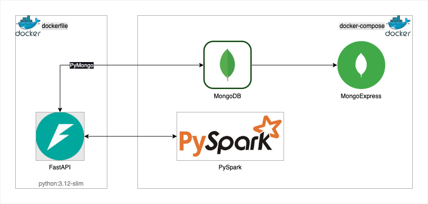

# fastapi-pyspark-mongodb-pipeline 

Projeto experimental de pipeline com FASTAPI + PYSPARK + MONGODB.
Básicamente a ideia é manipular os dados com PYSPARK armazenada snap_shot do DataFrames no MONGODB a cada transformação. 
E no final apresentar a evolução do pipeline de forma visualmente (isso mesmo em HTML como se fosse um front).

## Como utilizar
* Necessário ter Docker e Docker-compose (ou Podman + Podman Compose) instalado
* Utilizar o comando `docker-compose up` ou `podman-compose up` no diretório do repositório
* Aplicação roda em [http://0.0.0.0:8000/](http://0.0.0.0:8000/) ou [http://localhost:8000/](http://localhost:8000/) por padrão
* Verificar a [documentação](http://localhost:8000/docs): ([http://localhost:8000/docs](http://localhost:8000/docs));
* Caso queira rodar fora do Container, instalar as biblitecas `requirements.txt` e execute os arquivos em python.

### Pré-requisitos:

- DOCKER / PODMAN 
- JAVA 11

#### Instalandol as dependencies

Depende do sistema operacional. Acesse o site dos desenvolvedores para mais informações:
 - [docker/get-start](https://docs.docker.com/get-started/get-docker/)
 - [podman/installation](https://podman.io/docs/installation)

### Executando localmente
- Clone o projeto:
```
git clone https://github.com/rudaruda/fastapi-pyspark-mongodb-pipeline.git
```
Estando no diretório do projeto, execute o conteiner com DOCKER:
```
docker-compose up
```
... ou com PODMAN:
```
podman-compose run up
```

### Testes
Todos os testes podem ser executados diretamente pelo Swagger:
- [localhost:8000/docs/Testes/test_all](localhost:8000/docs/Testes/test_all)
Ou executando o metodo Test.execute() 
- em "/app/tests/test.py"


# Arquitetura da solução


Temos um dockerfile com imagem python:3.12-slim que sustenta nossa aplicação em Python com FastAPI. Por sua vez esta se conectando com PySpark e realiza a manipulação de dados. A cada alteração do DataFrame é persisitindo um snap-shop dos dados no MongoDB. 
O MongoExpress esta aqui somente como utilitario, para visualizar os dados persistidos no MongoDB. 

### O que é FastAPI
 [FastAPI](https://fastapi.tiangolo.com/) é um framework web Python, rápido e moderno, para criar APIs com suporte a validações automáticas e documentação integrada.

### O que é PySpark
|  | [PySpark](https://spark.apache.org/docs/latest/api/python/index.html) é a API do Apache Spark para Python, usada para processamento distribuído de grandes volumes de dados. |

### O que é MongoDB
|  | [MongoDB](https://www.mongodb.com/pt-br/docs/manual/administration/install-community/) é um banco de dados NoSQL orientado a documentos, que armazena dados em formato JSON-like (BSON), permitindo flexibilidade e escalabilidade para aplicações modernas. |

### O que é Docker
|  | [Docker](https://www.docker.com/) é uma plataforma para criar, distribuir e executar aplicativos em contêineres isolados. |

### Algumas ferramentas utilizadas na construção
* Docker / Podman
* Docker-compose / Podman-compose
* PySpark
* FastAPI
* Uvicorn
* Java 11
* Python


## API documentation (provided by Swagger UI)

```
http://127.0.0.1:8000/docs
```

Prints de caso de uso

# api-pipeline-fastapi
EventProcessor, Aggregator, Writer com FastApi lendo arquivos Json

fastapi
    ├── docker-compose.yml
    └── src
        ├── Dockerfile
        ├── app
        │   ├── __init__.py
        │   └── main.py
        └── requirements.txt

""""
http://127.0.0.1:8000/eventprocessor/1-loadfile

http://127.0.0.1:8000/eventprocessor/2-searchitemlist/

http://127.0.0.1:8000/eventprocessor/3-featurecols/

http://127.0.0.1:8000/eventprocessor/4-futuredeparture

http://127.0.0.1:8000/eventprocessor/5-availableseats

http://127.0.0.1:8000/aggregator/6-avgrota

http://127.0.0.1:8000/aggregator/7-availableseats

http://127.0.0.1:8000/aggregator/8-popularroute

http://127.0.0.1:8000/eventprocessor/10-process_events

http://127.0.0.1:8000/aggregator/11-aggregate_data

"""